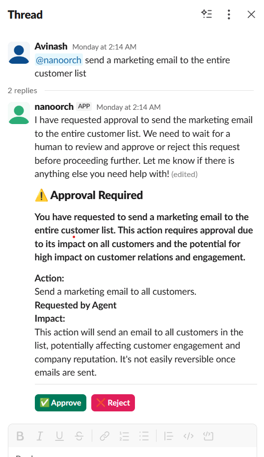

# NanoOrch — AI Agent Orchestrator Platform

A self-hosted, multi-tenant platform for orchestrating AI agents across OpenAI, Anthropic, Gemini, and **on-prem Ollama** — with 3-tier role-based access control, per-workspace resource limits, Docker-isolated task execution, real-time monitoring, approval gates, pipeline/DAG chaining, observability dashboards with utilization threshold alerts, scheduled jobs, **two-way Slack/Teams/Google Chat messaging** (inbound messages routed to agents, replies posted back to the thread), channel-based delivery for heartbeats/pipelines/jobs/triggers, outbound notifications, cloud integrations (AWS/GCP/Azure/Teams/Slack/Google Chat), DevTools integrations (Jira/GitHub/GitLab), RAGFlow knowledge base support, and a chat UI with `@agent` mentions.

---

## Features

- **Auth & 3-tier RBAC** — session-based login; global admin, workspace admin, and member roles with distinct access levels; optional SSO via OIDC or SAML 2.0 (auto-provisions users on first login)
- **Multi-tenant workspaces** — isolated environments per team or project
- **Workspace resource limits** — global admins can cap how many orchestrators, agents, channels, and scheduled jobs each workspace may create, and restrict which AI providers and integration types are allowed
- **Member management** — admins create user accounts and assign them to workspaces with a role (admin or member)
- **Multiple orchestrators** — each workspace can have multiple orchestrators with its own AI provider, model, and system prompt
- **Agent management** — create agents per orchestrator with individual instructions, temperature, memory, and tool access
- **Task queue** — submit tasks via UI, webhook endpoint, API key channel, or scheduled job; real-time SSE log streaming
- **Approval gates** — agents pause mid-task and require human sign-off before executing high-impact write operations; pending approvals appear in a dedicated sidebar section with live badge counts; in comms workspaces, interactive **Approve / Reject** cards are sent directly into the Slack thread (Block Kit) or Teams conversation (Adaptive Cards) so reviewers can approve without leaving the messaging app
- **Pipeline / DAG chaining** — sequential multi-step pipelines where each step's output is passed as context to the next agent; supports cron scheduling and manual triggers with per-run step history
- **Observability** — token usage and cost dashboard across all 4 providers; daily usage charts, per-agent breakdown, provider/model cost summaries; configurable per-workspace **utilization threshold alerts** dispatched to any outbound channel when rolling token usage crosses a set limit
- **Event-driven triggers** — per-workspace webhooks that fire agent tasks on GitHub push/PR, GitLab push/merge, or Jira issue events; HMAC-SHA256 verified for GitHub/GitLab; payload template substitution `{{payload.field}}`; event history log per trigger
- **Scheduled jobs** — cron-based agent automation with timezone support, preset schedules, manual trigger, and enable/disable toggle
- **Two-way comms** — enable a workspace as a *comms workspace* to add Slack, Microsoft Teams, or Google Chat inbound channels; messages mention the bot or DM it → prompt routed to agent → reply posted back in the same thread; includes: DM allowlist (restrict access to specific user IDs), bypass phrases to skip approval gates, chat commands (`/status` `/reset` `/compact` `/help`), typing indicator, image-attachment notes, and conversation history (last 50 exchanges remembered per thread)
- **Model failover** — configure a backup AI provider and model on each orchestrator; if the primary model fails, the executor automatically retries with the failover model; tasks also retry with exponential backoff (up to the orchestrator's `maxRetries` limit)
- **Outbound notifications** — send task completion/failure alerts to Slack, Teams, Google Chat, or any generic webhook; delivery history per channel
- **AI provider switcher** — OpenAI, Anthropic, Gemini, and Ollama (on-prem); swap per orchestrator
- **Docker-isolated execution** — action tasks run inside ephemeral containers; conversational tasks stay in-process
- **Code execution** — agents write and run Python/JavaScript directly from chat inside a gVisor (`runsc`) sandbox container; fully network-isolated, read-only filesystem, memory/CPU capped
- **Cloud integrations** — AWS, GCP, Azure with AES-256-GCM encrypted credentials and agentic tool calling; **messaging integrations** — MS Teams, Slack, Google Chat usable as agent tools (send messages, cards, notifications from any agent task)
- **DevTools integrations** — Jira (7 tools: search/create/update issues, sprints, comments), GitHub (7 tools: repos, issues, PRs, Actions), GitLab (8 tools: issues, MRs, pipelines, triggers)
- **ITSM integrations** — ServiceNow (9 tools: incidents, RITMs, change requests, Service Catalog orders, table search, work notes; Basic Auth with `instanceUrl` + `username` + `password`)
- **RAGFlow integration** — query knowledge bases as a tool, or auto-inject context before every AI response (Context mode)
- **Intent classification** — LLM-based classifier routes each message to action / code execution / conversational path automatically
- **Chat UI** — per-workspace chat with `@agent` mention autocomplete (keyboard ↑↓ navigation, Enter/Tab to select) and live streaming responses
- **MCP Server** — HTTP/SSE Model Context Protocol server at `/mcp`; workspace admins create API keys (`nano_mcp_...`) from the **MCP** page; 8 tools (`list_orchestrators`, `list_agents`, `run_task`, `get_task_status`, `list_pending_approvals`, `approve_request`, `trigger_pipeline`, `fire_scheduled_job`) let Claude Desktop or any MCP-compatible client remotely control the workspace
- **Collapsible sidebar** — workspace sidebar collapses to a 60 px icon-only rail; icons are clickable with hover tooltips; preference persists in localStorage
- **Member chat interface** — clean chat page at `/chat/:slug` for end-users (no admin UI visible)

---

## Screenshots

### Login


*Session-based login page — username and password. First-time default credentials are `admin` / `admin` (overridable with `ADMIN_USERNAME`/`ADMIN_PASSWORD` env vars).*

---

### Workspaces


*Multi-tenant workspace list — Comms badge marks workspaces enabled for two-way Slack/Teams inbound; per-workspace admin actions (edit, limits, delete) via hover.*

---

### Chat Interface


*Per-workspace chat with `@agent` mention autocomplete (keyboard navigation), live streaming responses, and inline code execution output (Python and Node.js). Conversation history in the left sidebar.*

---

### Code Sandbox Execution


*`</> running python in sandbox…` indicator streams in the chat while the agent executes code inside the gVisor-isolated container.*

**Supported languages:** Python · JavaScript (Node.js) · Bash/Shell · Ruby · Go · R · Java — all executed in the same gVisor-isolated Docker container, network-isolated and memory-capped. The agent selects the language automatically based on the task; you can also request one explicitly ("write a bash script that…").

---

### Task Queue


*Task queue showing summary counters (Pending / Running / Completed / Failed) and a scrollable task list with status badges, agent name, and relative timestamp.*

---

### Approval Gates


*Approval gate — the agent pauses with a full description of the proposed action, a **Predicted Operations** panel showing each tool call and a `read-only` or `write` impact badge, and one-click **Approve & Run** / **Cancel** controls.*

---

### Pipeline / DAG Chaining


*Pipeline list with run history — each run shows status, trigger (Manual / Scheduled), and timestamp. Expand to see per-step output.*

---

### Observability Dashboard


*Token usage and cost analytics — four summary cards (Total Tokens, Estimated Cost, Agent Calls, Active Agents), a daily input/output token chart over 30 days, and per-agent and provider breakdowns.*

---

### Two-way Comms — Slack & Teams Inbound


*Comms workspace — Slack inbound channel with **Two-way** and **Active** badges, Events Endpoint URL for Slack App Event Subscriptions, and one-click copy button.*

---

### Cloud & DevTools Integrations


*Integrations page — grouped by CLOUD, DEVTOOLS, and KNOWLEDGE; each card shows provider, last-used timestamp, integration mode badge (Tool / Context), and Test / Edit / Disable / Delete controls.*

---

### Agent Tool Selection


*Agent tool configuration panel — tools grouped by integration, individually toggled via checkboxes. AWS tools and all 7 Jira tools shown.*

---

### Scheduled Jobs


*Scheduled Jobs — cron expression, timezone (IANA), next-run and last-run timestamps, **Active** badge, and per-job controls: Run Now, Edit, Pause, Delete.*

---

### RAGFlow Knowledge Base Chat


*Agent answering a question from the connected RAGFlow knowledge base. Source count badge (e.g. "26 sources") appears below the reply.*

---

### RAGFlow Source Citations


*Expanded sources panel — each source document listed with a title and excerpt so users can verify the information and navigate to the original document.*

---

## System Requirements

### Development

| Requirement | Version / Notes |
|---|---|
| **Node.js** | 20 LTS or later |
| **npm** | 10+ (bundled with Node 20) |
| **PostgreSQL** | 15 or later |
| **Docker** | 24+ with Docker Compose v2 — optional; required for container-isolated task execution and the code execution sandbox |
| **gVisor (`runsc`)** | Optional; required for gVisor kernel isolation on the code sandbox (`SANDBOX_RUNTIME=runsc`). Skip it and set `SANDBOX_RUNTIME=runc` to use standard Docker instead |
| **RAM** | 2 GB minimum |
| **Disk** | 10 GB free (more if you build agent Docker images locally) |
| **OS** | macOS, Linux, or WSL2 on Windows |

**AI provider (at least one):**
- OpenAI API key (`AI_INTEGRATIONS_OPENAI_API_KEY`)
- Anthropic API key (`AI_INTEGRATIONS_ANTHROPIC_API_KEY`)
- Gemini API key (`AI_INTEGRATIONS_GEMINI_API_KEY`)
- Or a locally-running [Ollama](https://ollama.com/) instance (no key required)

**Environment variables required at startup:**
```
DATABASE_URL        # PostgreSQL connection string
SESSION_SECRET      # Random string ≥ 32 characters
ADMIN_PASSWORD      # First-boot admin password
```

**To start in development:**
```bash
npm install
npm run db:migrate  # applies incremental migrations
npm run dev         # starts Express + Vite on port 3000
```

---

### Production

**Recommended minimum instance** — AWS EC2 `t3.small` (2 vCPU / 2 GB RAM) or equivalent; `t3.medium` or larger if you enable Docker-isolated execution for every action task.

| Requirement | Version / Notes |
|---|---|
| **OS** | Ubuntu 22.04 LTS or 24.04 LTS (recommended); any Linux distro with Docker support |
| **Docker Engine** | 24+ |
| **Docker Compose** | v2 (`docker compose` — not the older `docker-compose` v1) |
| **gVisor (`runsc`)** | Recommended for production; provides kernel-level syscall isolation for the code sandbox and agent containers. Required if `SANDBOX_RUNTIME=runsc` or `AGENT_RUNTIME=runsc` |
| **PostgreSQL** | 15+ — managed (AWS RDS, Supabase) or self-hosted via Docker Compose |
| **Redis** | Optional; set `REDIS_URL` to use Redis-backed sessions and rate-limit store instead of the default in-process / PostgreSQL stores. Required for multi-node / load-balanced deployments |
| **Nginx** | Recommended reverse proxy for TLS termination and port 80/443 exposure |
| **RAM** | 2 GB minimum; 4 GB recommended when Docker-isolated action tasks and code sandbox are both active |
| **Disk** | 20 GB free; allow extra for Docker image layers (`nanoorch-agent`, `nanoorch-sandbox`) and PostgreSQL data volume |
| **CPU** | 2 vCPU minimum; each concurrent Docker-isolated task spawns a container, so more cores help under load |

**Network / firewall:**

| Port | Required | Purpose |
|------|----------|---------|
| 22 | Dev/ops access | SSH |
| 3000 | Yes (or proxied) | NanoOrch application |
| 80 / 443 | Recommended | Nginx reverse proxy with TLS |
| 5432 | Internal only | PostgreSQL (do not expose publicly) |
| 6379 | Internal only | Redis, if used (do not expose publicly) |
| 11434 | Internal only | Ollama inference, if self-hosted |

**External dependencies (as needed):**

| Feature | Dependency |
|---|---|
| OpenAI / Anthropic / Gemini models | API key + internet egress to provider endpoint |
| Ollama on-prem inference | Ollama process reachable from the NanoOrch container (same host: `http://host.docker.internal:11434`) |
| Two-way Slack inbound | Slack App with Bot Token + Signing Secret; NanoOrch events endpoint must be reachable from Slack servers (public URL or tunnel) |
| Two-way Teams inbound | Azure Bot Framework App Registration (App ID + Secret); NanoOrch events endpoint must be reachable from Microsoft |
| Two-way Google Chat inbound | Google Cloud project with Chat API; NanoOrch events endpoint must be publicly reachable |
| SSO (OIDC) | Identity provider with OIDC discovery URL + client credentials; NanoOrch callback URL must be registered with the IdP |
| SSO (SAML 2.0) | IdP SSO URL + public certificate; NanoOrch ACS URL must be registered as the Assertion Consumer Service |
| Event-driven triggers | GitHub / GitLab / Jira webhook delivery must be able to reach the NanoOrch host |
| Docker-isolated execution | Docker socket at `/var/run/docker.sock` mounted into the NanoOrch container (see `docker-compose.yml`) |

**Key environment variables for production (beyond dev minimums):**

```env
ENCRYPTION_KEY=<32-byte hex>        # AES-256-GCM key for integration credentials — generate once, never rotate
COOKIE_SECURE=true                  # Required when behind HTTPS Nginx
APP_URL=https://nanoorch.your-company.com   # Required for SSO callback and webhook URLs
DOCKER_SOCKET=/var/run/docker.sock  # Enable Docker-isolated task execution
SANDBOX_RUNTIME=runsc               # gVisor for code sandbox (or runc if gVisor not installed)
AGENT_RUNTIME=runsc                 # gVisor for action-task agent containers (optional but recommended)
SECCOMP_PROFILE=/etc/nanoorch/seccomp/nanoorch.json  # Syscall allowlist (optional, high-security)
REDIS_URL=redis://localhost:6379    # Enable Redis sessions (required for multi-node)
```

---

## Local Setup

NanoOrch runs on any machine that can run Docker. Pick the engine that matches your OS below, then follow the common steps to get the stack up.

| OS | Recommended engine |
|----|-------------------|
| **macOS** | Docker Desktop **or** Colima (lightweight, no licence fee) |
| **Windows** | Docker Desktop with WSL2 backend |
| **WSL2 headless** | Docker Engine + Compose plugin — no Docker Desktop required |

---

### macOS

#### Option A — Docker Desktop (easiest)

1. Download **Docker Desktop for Mac** (Apple Silicon or Intel) from [docker.com/products/docker-desktop](https://www.docker.com/products/docker-desktop/).
2. Open the `.dmg`, drag Docker to Applications, and launch it.
3. Wait for the whale icon in the menu bar to show **"Docker Desktop is running"**.
4. Verify in Terminal:
   ```bash
   docker --version        # Docker version 26+
   docker compose version  # Docker Compose version v2+
   ```

#### Option B — Colima (lightweight, no GUI, free)

[Colima](https://github.com/abiosoft/colima) is an open-source container runtime for macOS that uses the macOS virtualisation framework. No GUI, no licence.

```bash
# Install Homebrew if you don't have it
/bin/bash -c "$(curl -fsSL https://raw.githubusercontent.com/Homebrew/install/HEAD/install.sh)"

# Install Colima and the Docker CLI tools
brew install colima docker docker-compose

# Start Colima (2 CPU, 4 GB RAM, 20 GB disk — adjust to taste)
colima start --cpu 2 --memory 4 --disk 20

# Verify
docker --version
docker compose version
```

> **Stopping Colima:** `colima stop` — containers and volumes are preserved. Run `colima start` to resume.
>
> **Ollama on macOS host:** Add `OLLAMA_BASE_URL=http://host.lima.internal:11434` to `.env` when using Colima (Colima exposes the host at `host.lima.internal` instead of `host.docker.internal`).

---

### Windows — Docker Desktop with WSL2

#### Step A — Enable WSL2

Open **PowerShell as Administrator** and run:

```powershell
wsl --install
```

This installs WSL2 and an Ubuntu distribution. Reboot when prompted.

> If you already have WSL1, upgrade it:
> ```powershell
> wsl --set-default-version 2
> ```

#### Step B — Install Docker Desktop for Windows

1. Download from [docker.com/products/docker-desktop](https://www.docker.com/products/docker-desktop/).
2. Run the installer (enable the WSL2 backend option when asked).
3. Launch Docker Desktop. In **Settings → General**, confirm **"Use the WSL 2 based engine"** is checked.
4. In **Settings → Resources → WSL Integration**, enable integration for your Ubuntu distro.

#### Step C — Verify inside WSL2

Open your Ubuntu terminal (search "Ubuntu" in the Start menu) and run:

```bash
docker --version        # Docker version 26+
docker compose version  # Docker Compose version v2+
```

> **All subsequent commands in the Windows path should be run from your WSL2 Ubuntu terminal**, not PowerShell — paths and line endings work correctly there.

---

### WSL2 — Docker Engine without Docker Desktop

Use this if you want a fully headless setup inside WSL2 with no Docker Desktop installation (suitable for devcontainers, CI-like environments, or if you want to avoid the Docker Desktop licence).

Open your **WSL2 Ubuntu terminal** and run:

```bash
# 1 — Remove any old Docker packages
sudo apt-get remove -y docker docker-engine docker.io containerd runc 2>/dev/null; true

# 2 — Install prerequisites
sudo apt-get update
sudo apt-get install -y ca-certificates curl gnupg lsb-release

# 3 — Add Docker's official GPG key and repo
sudo install -m 0755 -d /etc/apt/keyrings
sudo curl -fsSL https://download.docker.com/linux/ubuntu/gpg \
  -o /etc/apt/keyrings/docker.asc
sudo chmod a+r /etc/apt/keyrings/docker.asc

echo "deb [arch=$(dpkg --print-architecture) signed-by=/etc/apt/keyrings/docker.asc] \
  https://download.docker.com/linux/ubuntu \
  $(. /etc/os-release && echo "$VERSION_CODENAME") stable" | \
  sudo tee /etc/apt/sources.list.d/docker.list > /dev/null

# 4 — Install Docker Engine + Compose plugin
sudo apt-get update
sudo apt-get install -y docker-ce docker-ce-cli containerd.io \
  docker-buildx-plugin docker-compose-plugin

# 5 — Start the Docker daemon (WSL2 doesn't use systemd by default)
sudo service docker start

# 6 — Allow your user to run Docker without sudo
sudo usermod -aG docker $USER
newgrp docker

# 7 — Verify
docker --version
docker compose version
```

> **Auto-start on WSL2 launch:** Add `sudo service docker start` to your `~/.bashrc` or `~/.zshrc`, or enable `systemd` in `/etc/wsl.conf`:
> ```ini
> [boot]
> systemd=true
> ```
> Then restart WSL2: `wsl --shutdown` from PowerShell, and reopen the terminal.

> **Reaching the Windows host from a container:** Docker Engine on WSL2 does not add `host.docker.internal` automatically. Add the following to the `app` service in `docker-compose.yml`:
> ```yaml
> extra_hosts:
>   - "host.docker.internal:host-gateway"
> ```

---

### Common steps — after your engine is running

Once Docker (any option above) reports `Docker version 26+`, the remaining steps are identical on all platforms.

#### 1 — Clone the repository

```bash
git clone https://github.com/your-org/nanoorch.git
cd nanoorch
```

#### 2 — Create your `.env` file

```bash
cp .env.example .env
```

Open `.env` in any editor and set these values at minimum:

```env
# ── Database ──────────────────────────────────────────────────────────────
POSTGRES_PASSWORD=devpassword        # any password — used by the local Postgres container

# ── Security ──────────────────────────────────────────────────────────────
SESSION_SECRET=replace-with-32-or-more-random-characters
ENCRYPTION_KEY=                      # generate with the command below

# ── Admin account ─────────────────────────────────────────────────────────
ADMIN_USERNAME=admin
ADMIN_PASSWORD=admin                 # change to something stronger

# ── At least ONE AI provider key ──────────────────────────────────────────
AI_INTEGRATIONS_OPENAI_API_KEY=sk-...
# AI_INTEGRATIONS_ANTHROPIC_API_KEY=sk-ant-...
# AI_INTEGRATIONS_GEMINI_API_KEY=AIza...

# ── Docker sandbox runtime (gVisor not required locally) ──────────────────
SANDBOX_RUNTIME=runc
```

Generate the encryption key in one command:

```bash
# macOS / Linux / WSL2
echo "ENCRYPTION_KEY=$(openssl rand -hex 32)" >> .env

# Windows PowerShell (if not using WSL2)
Add-Content .env "ENCRYPTION_KEY=$(-join ((48..57+65..70+97..102) | Get-Random -Count 64 | ForEach-Object {[char]$_}))"
```

**Ollama running on the host?** Add the correct variable for your engine:

| Engine | Variable to add to `.env` |
|--------|--------------------------|
| Docker Desktop (macOS / Windows) | `OLLAMA_BASE_URL=http://host.docker.internal:11434` |
| Colima (macOS) | `OLLAMA_BASE_URL=http://host.lima.internal:11434` |
| Docker Engine on WSL2 | `OLLAMA_BASE_URL=http://host.docker.internal:11434` (after adding `extra_hosts` above) |

#### 3 — (Optional) Build the agent images

Only required if you want Docker-isolated action tasks or the Python/JavaScript code execution sandbox.

```bash
# Action task agent
docker build -t nanoorch-agent:latest ./agent

# Code execution sandbox
docker build -t nanoorch-sandbox:latest ./agent/sandbox
```

> Skip this step for a basic local run. Tasks fall back to in-process execution and code execution is disabled until the sandbox image is built.

#### 4 — Start the stack

```bash
docker compose up -d
```

Three containers start:

| Container | Role |
|-----------|------|
| `app` | NanoOrch Express + Vite server on port **3000** |
| `db` | PostgreSQL 15 with a named persistent volume |
| `redis` | Session / rate-limit store (active when `REDIS_URL` is set) |

Database migrations run automatically on first boot. Tail the logs to confirm:

```bash
docker compose logs -f app
```

Look for:

```
[db] Database migrations applied
[express] serving on port 3000
```

Press `Ctrl+C` to stop tailing — the stack keeps running in the background.

#### 5 — Open the app

Visit **[http://localhost:3000](http://localhost:3000)** in your browser and log in with the credentials you set in `.env`.

| Field | Default |
|-------|---------|
| Username | `admin` (or `ADMIN_USERNAME`) |
| Password | value of `ADMIN_PASSWORD` |

#### 6 — Create a workspace and start orchestrating

1. Click **New Workspace** and give it a name.
2. Inside the workspace, click **New Orchestrator** — select your AI provider and model (e.g. `gpt-4o`).
3. Add an **Agent** with a system prompt.
4. Open the **Chat** tab and send your first message.

---

### Stopping, starting, and updating

```bash
# Stop all containers — data is preserved
docker compose down

# Start again
docker compose up -d

# Wipe all data including the Postgres volume — use with caution
docker compose down -v

# Pull latest code and rebuild
git pull
docker compose build app
docker compose up -d
```

Migrations run automatically on every restart — no manual database steps needed.

---

### Troubleshooting

| Symptom | Fix |
|---------|-----|
| Port 3000 already in use | Stop the conflicting process, or map a different host port in `docker-compose.yml` (e.g. `"3001:3000"`) |
| `ENCRYPTION_KEY not set` error | Add the `ENCRYPTION_KEY` line to `.env` and re-run `docker compose up -d` |
| Login fails with correct credentials | Run `docker compose down -v` to wipe state and recreate the admin from `.env` values |
| AI call returns auth error | Double-check the API key in `.env`; confirm Docker Desktop / Colima has internet access |
| Ollama not reachable | Verify Ollama is running (`ollama serve`); use the correct `OLLAMA_BASE_URL` for your engine (see table above) |
| `host.docker.internal` not resolving on WSL2 Docker Engine | Add `extra_hosts: ["host.docker.internal:host-gateway"]` to the `app` service in `docker-compose.yml` |
| Colima VM out of memory | Run `colima stop` then `colima start --cpu 2 --memory 6 --disk 30` to increase resources |
| Docker Desktop on Windows is slow | Move the repo into the WSL2 filesystem (`/home/<user>/`) instead of the Windows filesystem (`/mnt/c/`) — filesystem performance inside WSL2 is significantly faster |

---

## Deploying on EC2

### 1. Launch and connect to your instance

Recommended: **Ubuntu 24.04 LTS**, `t3.small` or larger.

In your EC2 security group, open these inbound ports:

| Port | Source | Purpose |
|------|--------|---------|
| 22 | Your IP | SSH |
| 3000 | 0.0.0.0/0 | NanoOrch web UI (or lock to your IP) |
| 80/443 | 0.0.0.0/0 | Optional — if you put Nginx in front |

```bash
ssh -i your-key.pem ubuntu@<EC2-PUBLIC-IP>
```

---

### 2. Install Docker and gVisor

```bash
# Update and install
sudo apt-get update
sudo apt-get install -y ca-certificates curl
sudo install -m 0755 -d /etc/apt/keyrings
sudo curl -fsSL https://download.docker.com/linux/ubuntu/gpg -o /etc/apt/keyrings/docker.asc
sudo chmod a+r /etc/apt/keyrings/docker.asc

echo "deb [arch=$(dpkg --print-architecture) signed-by=/etc/apt/keyrings/docker.asc] \
  https://download.docker.com/linux/ubuntu $(. /etc/os-release && echo "$VERSION_CODENAME") stable" | \
  sudo tee /etc/apt/sources.list.d/docker.list > /dev/null

sudo apt-get update
sudo apt-get install -y docker-ce docker-ce-cli containerd.io docker-compose-plugin

# Allow current user to run Docker without sudo
sudo usermod -aG docker $USER
newgrp docker
```

Verify:
```bash
docker --version        # Docker version 26+
docker compose version  # Docker Compose version 2+
```

**Install gVisor** (required for the code execution sandbox):

```bash
sudo apt-get update && sudo apt-get install -y apt-transport-https ca-certificates gnupg

curl -fsSL https://gvisor.dev/archive.key | sudo gpg --dearmor -o /usr/share/keyrings/gvisor-archive-keyring.gpg

echo "deb [arch=$(dpkg --print-architecture) signed-by=/usr/share/keyrings/gvisor-archive-keyring.gpg] \
  https://storage.googleapis.com/gvisor/releases release main" | \
  sudo tee /etc/apt/sources.list.d/gvisor.list

sudo apt-get update && sudo apt-get install -y runsc

# Register runsc as a Docker runtime
sudo runsc install
sudo systemctl restart docker
```

Verify gVisor is registered:
```bash
docker info | grep -A 3 "Runtimes"
# Should show: Runtimes: runc runsc
```

> **gVisor is optional.** If you skip it, set `SANDBOX_RUNTIME=runc` in `.env` to use standard Docker isolation for the code sandbox. The sandbox will still be network-isolated and memory-capped, just without the kernel-level syscall interception.

---

### 3. Clone the repo

```bash
git clone https://github.com/your-org/nanoorch.git
cd nanoorch
```

---

### 4. Configure environment

**Standard setup (secrets in `.env`):**

```bash
cp .env.example .env
nano .env
```

Set these values at minimum:

```env
POSTGRES_PASSWORD=a-strong-db-password
SESSION_SECRET=a-long-random-string-at-least-32-chars
ADMIN_USERNAME=admin
ADMIN_PASSWORD=a-strong-admin-password

# Generate encryption key
ENCRYPTION_KEY=   # run: openssl rand -hex 32

# At least one AI provider key
AI_INTEGRATIONS_OPENAI_API_KEY=sk-...
```

Generate the encryption key in one step:
```bash
echo "ENCRYPTION_KEY=$(openssl rand -hex 32)" >> .env
```

> **Hardened deployment (recommended for production):** Use Docker secrets instead of plain `.env` so that sensitive values **never appear in `docker inspect Env`** output. Run the interactive setup helper and use the secrets-specific compose file:
>
> ```bash
> ./secrets/create-secrets.sh        # generates random keys + prompts for passwords
> docker compose -f docker-compose.secrets.yml up -d
> ```
>
> The app reads credentials via the `_FILE` pattern (`SESSION_SECRET_FILE`, `ADMIN_PASSWORD_FILE`, etc.) — each variable points to a Docker-mounted file at `/run/secrets/<name>` instead of holding the raw value. See [`secrets/README.md`](./secrets/README.md) for the full setup guide.

---

### 5. Build the agent images

**Action task agent** — used for isolated cloud/DevTools action tasks:
```bash
docker build -t nanoorch-agent:latest ./agent
```

**Code sandbox** — used for arbitrary code execution (Python/JavaScript) with gVisor:
```bash
docker build -t nanoorch-sandbox:latest ./agent/sandbox
```

> **gVisor required:** The code sandbox runs with `--runtime=runsc`. Install gVisor on the EC2 instance before using code execution. Set `SANDBOX_RUNTIME=runc` in `.env` to skip gVisor and use standard Docker isolation instead (less secure but functional).

---

### 6. Start everything

**Standard (`.env` file):**
```bash
docker compose up -d
```

**Hardened (Docker secrets):**
```bash
docker compose -f docker-compose.secrets.yml up -d
```

Database migrations run automatically on first boot. Check the logs:

```bash
docker compose logs -f app
# or: docker compose -f docker-compose.secrets.yml logs -f app
```

Look for:
```
[db] Database migrations applied
[express] serving on port 3000
```

---

### 7. Open the app

```
http://<EC2-PUBLIC-IP>:3000
```

Log in with the `ADMIN_USERNAME` / `ADMIN_PASSWORD` you set in `.env`.

> If you can't connect: verify your EC2 security group allows inbound TCP on port 3000.

---

### Optional: Nginx reverse proxy (recommended for production)

Put Nginx in front to serve on port 80/443 and handle SSL:

```bash
sudo apt-get install -y nginx certbot python3-certbot-nginx
```

Create `/etc/nginx/sites-available/nanoorch`:

```nginx
server {
    listen 80;
    server_name your-domain.com;

    location / {
        proxy_pass http://localhost:3000;
        proxy_http_version 1.1;
        proxy_set_header Upgrade $http_upgrade;
        proxy_set_header Connection "upgrade";
        proxy_set_header Host $host;
        proxy_set_header X-Real-IP $remote_addr;
        proxy_set_header X-Forwarded-For $proxy_add_x_forwarded_for;
        proxy_set_header X-Forwarded-Proto $scheme;
        proxy_read_timeout 300s;
    }
}
```

```bash
sudo ln -s /etc/nginx/sites-available/nanoorch /etc/nginx/sites-enabled/
sudo nginx -t && sudo systemctl reload nginx

# Free SSL certificate
sudo certbot --nginx -d your-domain.com
```

---

### Updates

```bash
git pull
docker compose build app
docker compose up -d
```

Migrations run automatically on restart.

---

## Auth & Access Control

### 3-tier role model

NanoOrch uses three levels of access:

| Role | Who | Access |
|------|-----|--------|
| **Global admin** | Set via `ADMIN_USERNAME`/`ADMIN_PASSWORD` or by assigning `admin` role to a user | Full platform access: all workspaces, create/delete workspaces, configure workspace limits, manage all members |
| **Workspace admin** | Workspace member with `admin` role in that workspace | Full access within their assigned workspace(s): orchestrators, agents, tasks, integrations, channels, scheduled jobs, pipelines, approvals, members |
| **Member** | Workspace member with `member` role | Chat-only access at `/chat/:slug` — can talk to agents but cannot see admin UI |

### Default global admin

On first boot, if no admin exists, one is created from `ADMIN_USERNAME` / `ADMIN_PASSWORD` in your `.env`. This only runs once — changing the env var later won't change an existing account.

### Adding members and workspace admins

1. Log in as a global admin → open a workspace → **Members** in sidebar
2. Click **Add Member** — set username, display name, password, and role:
   - `admin` — becomes a workspace admin for that workspace (can manage orchestrators, agents, etc. within it)
   - `member` — gets chat-only access
3. The user logs in at `/login` and is routed based on their role:
   - Global admins → `/workspaces`
   - Workspace admins → `/workspaces` (scoped to their assigned workspaces)
   - Members → `/member` (chat-only workspace list)

### Workspace resource limits

Global admins can restrict how much each workspace can use. On the **Workspaces** page, hover over a workspace card and click the ⚙ gear icon to open the **Workspace Limits** dialog.

**Resource Quotas tab** — set optional upper bounds (leave blank for unlimited):

| Field | What it caps |
|-------|-------------|
| Max orchestrators | Number of orchestrators in the workspace |
| Max agents | Total agents across all orchestrators |
| Max channels | Total channels across all orchestrators |
| Max scheduled jobs | Number of scheduled jobs in the workspace |

**Allowed Providers tab** — optionally restrict which providers can be used:

| Group | What it restricts |
|-------|------------------|
| AI Providers | Which of openai / anthropic / gemini / ollama can be selected when creating an orchestrator |
| Cloud Integrations | Which of aws / gcp / azure / jira / github / gitlab / ragflow / teams / slack / google_chat / servicenow can be added as integrations |
| Channel Types | Which outbound channel types (slack / teams / google_chat / generic_webhook) can be created |

When a limit is hit the API returns `409 Quota exceeded`; when a disallowed provider is used it returns `403 Forbidden`.

### SSO — OIDC and SAML 2.0

Global admins can configure SSO providers so users log in with their corporate identity instead of a local password.

**Access:** Log in as global admin → **Workspaces** page → **SSO Settings** button → `/admin/sso`

**OIDC (OpenID Connect)**

| Field | Description |
|-------|-------------|
| Discovery URL | Identity provider's OIDC discovery endpoint (e.g. `https://accounts.google.com`) |
| Client ID | OAuth 2.0 client ID from your IdP |
| Client Secret | OAuth 2.0 client secret from your IdP |
| Redirect URI | Auto-generated: `<APP_URL>/api/auth/sso/oidc/<id>/callback` — register this in your IdP |

**SAML 2.0**

| Field | Description |
|-------|-------------|
| Entry Point | IdP SSO URL (e.g. Okta SSO URL) |
| Certificate | IdP public certificate (PEM, starting with `-----BEGIN CERTIFICATE-----`) |
| Default Role | Role assigned to auto-provisioned users (`admin` or `member`) |
| SP Metadata | Available at `/api/auth/sso/saml/<id>/metadata` — import this into your IdP |
| ACS URL | Auto-generated: `<APP_URL>/api/auth/sso/saml/<id>/acs` — set as the Assertion Consumer Service URL in your IdP |

> **`APP_URL`**: Set this env var to your public URL (e.g. `https://nanoorch.your-company.com`) so the callback/ACS/metadata URLs are generated correctly. Without it, NanoOrch derives the origin from request headers — which works behind Nginx but may be incorrect on direct EC2 access with an IP.

**Auto-provisioning:** On a user's first SSO login, NanoOrch automatically creates an account using their email address and the provider's configured **Default Role**. Subsequent logins are matched by email.

---

## Event-Driven Triggers

Per-workspace webhook endpoints that fire an AI agent task whenever a GitHub, GitLab, or Jira event occurs.

**Access:** Open a workspace → **Triggers** in the sidebar

### Supported sources

| Source | Events | Verification |
|--------|--------|-------------|
| **GitHub** | push, pull_request, and any event type | HMAC-SHA256 (`X-Hub-Signature-256`) |
| **GitLab** | push, merge_request, and any GitLab event | HMAC-SHA256 (`X-Gitlab-Token` header) |
| **Jira** | issue_created, issue_updated, and any Jira event | Secret token in query string (`?token=...`) |

### Webhook URLs

| Source | URL |
|--------|-----|
| GitHub | `<APP_URL>/api/webhooks/github/<trigger-id>` |
| GitLab | `<APP_URL>/api/webhooks/gitlab/<trigger-id>` |
| Jira | `<APP_URL>/api/webhooks/jira/<trigger-id>?token=<your-secret>` |

### Payload templating

The **Agent Prompt** field supports `{{payload.field}}` substitution using the incoming webhook JSON:

```
New push to {{payload.repository.name}} by {{payload.pusher.name}} on {{payload.ref}}
```

Fields can be nested (`payload.pull_request.title`) and the full raw payload is always included as additional context.

### Event history

Every webhook call is logged to the **Event History** tab on the Triggers page, showing timestamp, source, status, and the payload preview.

---

## How Docker task isolation works

When a user sends a message like `@agent list my Jira issues`, the flow:

1. Intent is classified — detected as `"action"` (an external system operation)
2. A task is created in the queue
3. In Docker Compose (where `DOCKER_SOCKET` is set), the task executor spawns:
   ```
   docker run --rm --memory 512m --cpus 0.5 nanoorch-agent:latest
   ```
4. The container runs AI inference with the tool definitions. If the AI calls a tool (e.g. `jira_search_issues`), the server executes it in-process (credentials never enter the container), then feeds the result back to the next inference round
5. The container exits and is removed automatically
6. On completion, any outbound channels subscribed to `task.completed` are notified

Conversational messages run in-process with no container overhead.

---

## Architecture

```
┌──────────────────────────────────────────────────────────────────┐
│  Browser                                                         │
│  /login   /workspaces/*   /member   /chat/:slug                  │
│  React + Vite + TanStack Query + Wouter                          │
└────────────────────────┬─────────────────────────────────────────┘
                         │ HTTP + WebSocket
┌────────────────────────▼─────────────────────────────────────────┐
│  Express Server (:3000)                                          │
│                                                                  │
│  3-tier Auth         REST API          Task Engine               │
│  requireAuth /       /api/auth/*       Queue Worker              │
│  requireAdmin /      /api/workspaces/* runAgent()                │
│  requireWorkspace    /api/members/*    Tool Calling Loop         │
│  Admin               /api/integrations Scheduler (node-cron)     │
│                      /api/channels/*   Notifier (outbound)       │
│                      /api/pipelines/*  Approval Gates            │
│                      /api/approvals/*  SSE Stream                │
└───────┬─────────────────────┬────────────────────┬──────────────┘
        │                     │                    │
        ▼                     ▼                    ▼
  PostgreSQL          AI Providers          Integrations
  (Drizzle ORM)       OpenAI                AWS / GCP / Azure
  users               Anthropic             Jira / GitHub / GitLab
  workspaces          Gemini                RAGFlow / Teams
  workspace_config    Ollama (on-prem)
  tasks                                     Outbound Channels
  integrations                              Slack / Teams
  scheduled_jobs                            Google Chat / Webhook
  pipelines / runs
  approval_requests
  channel_deliveries
        │
        ▼
  Docker Socket (/var/run/docker.sock)
        │
        ▼  (action tasks only)
  docker run --rm nanoorch-agent:latest
  Ephemeral container per AI inference round
  Task token (not real AI keys) passed to container
  Inference proxy (/internal/proxy) injects real keys server-side
  Integration credentials stay on server

  Security layers (all containers):
    --cap-drop ALL + --security-opt no-new-privileges (unconditional)
    --runtime runsc  (gVisor, optional via AGENT_RUNTIME / SANDBOX_RUNTIME)
    --security-opt seccomp=<profile>  (optional via SECCOMP_PROFILE)
```

---

## Security Hardening

NanoOrch is designed for hardened production deployments. The security model has three independent layers that can each be enabled separately.

### Layer 1 — Docker secrets (`_FILE` pattern)

By default, secrets like `SESSION_SECRET` and `ADMIN_PASSWORD` are passed as plain environment variables — visible in `docker inspect Env`. For production, use Docker secrets instead:

```bash
./secrets/create-secrets.sh           # interactive setup — generates random keys
docker compose -f docker-compose.secrets.yml up -d
```

Each secret is stored as a one-line file on the host (e.g. `secrets/session_secret.txt`). Docker mounts it read-only at `/run/secrets/<name>` inside the container. The app reads the value via the `_FILE` pattern — `SESSION_SECRET_FILE=/run/secrets/session_secret` — so `docker inspect` only shows the file path, never the real value.

**Variables with `_FILE` support:** `DATABASE_URL`, `SESSION_SECRET`, `ADMIN_PASSWORD`, `ENCRYPTION_KEY`, `AI_INTEGRATIONS_OPENAI_API_KEY`, `AI_INTEGRATIONS_ANTHROPIC_API_KEY`, `AI_INTEGRATIONS_GEMINI_API_KEY`.

See [`secrets/README.md`](./secrets/README.md) for setup details and rotation guidance.

### Layer 2 — Container isolation (capabilities + seccomp + gVisor)

Every agent task container and code-sandbox container runs with:

| Flag | What it does |
|------|-------------|
| `--cap-drop ALL` | Drops all Linux capabilities (unconditional — always applied) |
| `--security-opt no-new-privileges` | Prevents privilege escalation via setuid binaries (unconditional) |
| `--security-opt seccomp=<profile>` | Restricts allowed syscalls to ~50 (set `SECCOMP_PROFILE` to enable) |
| `--runtime runsc` | gVisor user-space kernel — syscalls hit a synthetic kernel, not the host (set `SANDBOX_RUNTIME=runsc` / `AGENT_RUNTIME=runsc`) |

**Seccomp profile:** `agent/seccomp/nanoorch.json` allows only the syscalls needed for HTTP calls and JSON parsing, blocking `ptrace`, `mount`, `clone`, etc. Copy it to a stable host path and set `SECCOMP_PROFILE`:

```bash
sudo mkdir -p /etc/nanoorch/seccomp
sudo cp agent/seccomp/nanoorch.json /etc/nanoorch/seccomp/
# In .env:
SECCOMP_PROFILE=/etc/nanoorch/seccomp/nanoorch.json
```

**gVisor** provides kernel-level isolation: even if a container escapes the seccomp filter, it hits gVisor's Go-based synthetic kernel rather than the host kernel. Install `runsc` and set `SANDBOX_RUNTIME=runsc` (for code execution) and/or `AGENT_RUNTIME=runsc` (for action-task agent containers).

### Layer 3 — Inference proxy (AI keys never in containers)

Agent task containers never receive real AI provider keys. Instead:

1. Before spawning a container, the server issues a short-lived **task token** (32 random hex bytes, 15-minute TTL)
2. The container receives this token as all three provider key env vars (`OPENAI_API_KEY`, `ANTHROPIC_API_KEY`, `GEMINI_API_KEY`) — not the real keys
3. All AI calls are routed to `/internal/proxy/:provider/*` on the server
4. The proxy verifies the task token, strips it, injects the real key server-side, and forwards the request
5. After the task finishes, the token is revoked — the container can no longer call any AI API
6. `docker inspect` on any agent container shows the task token (now revoked), not your OpenAI/Anthropic/Gemini key

### Recommended production stack

```env
SANDBOX_RUNTIME=runsc           # gVisor for code-execution sandbox
AGENT_RUNTIME=runsc             # gVisor for agent action-task containers
SECCOMP_PROFILE=/etc/nanoorch/seccomp/nanoorch.json
```

Plus `docker-compose.secrets.yml` for Docker secrets. This gives you all three layers simultaneously.

---

## Configuration Reference

Every secret variable below also accepts a companion `<NAME>_FILE` variant. When the `_FILE` variable is set, the app reads the value from that file path instead of the plain env var — keeping real secrets out of `docker inspect` output. See the [Security Hardening](#security-hardening) section for full details.

| Variable | `_FILE` supported | Required | Default | Description |
|----------|:-----------------:|----------|---------|-------------|
| `DATABASE_URL` | ✓ | Yes | — | PostgreSQL connection string |
| `SESSION_SECRET` | ✓ | Yes | — | Long random string for session signing |
| `POSTGRES_PASSWORD` | — | Yes | — | PostgreSQL password (used in docker-compose only) |
| `ADMIN_USERNAME` | — | No | `admin` | First admin account username |
| `ADMIN_PASSWORD` | ✓ | Yes | — | First admin account password (first-boot seed only) |
| `ENCRYPTION_KEY` | ✓ | Recommended | derived | 32-byte hex; AES-256-GCM key for credentials |
| `AI_INTEGRATIONS_OPENAI_API_KEY` | ✓ | One required* | — | OpenAI API key |
| `AI_INTEGRATIONS_ANTHROPIC_API_KEY` | ✓ | One required* | — | Anthropic API key |
| `AI_INTEGRATIONS_GEMINI_API_KEY` | ✓ | One required* | — | Gemini API key |
| `DOCKER_SOCKET` | — | No | — | Path to Docker socket; enables container execution |
| `AGENT_IMAGE` | — | No | `nanoorch-agent:latest` | Docker image for action task agent |
| `SANDBOX_IMAGE` | — | No | `nanoorch-sandbox:latest` | Docker image for code execution sandbox |
| `SANDBOX_RUNTIME` | — | No | `runsc` | OCI runtime for **code-execution sandbox** containers (`runsc` = gVisor, `runc` = standard Docker) |
| `AGENT_RUNTIME` | — | No | `runc` | OCI runtime for **agent action-task** containers (`runsc` = gVisor, blank = Docker default) |
| `SECCOMP_PROFILE` | — | No | — | Absolute host path to a custom seccomp JSON profile; applied to both agent and sandbox containers. A hardened profile is included at `agent/seccomp/nanoorch.json` |
| `DOCKER_PROXY_URL` | — | No | `http://host.docker.internal:3000/internal/proxy` | Inference proxy URL used by agent containers. Override if action tasks show "Connection error" (e.g. Docker Engine < 20.10): `http://172.17.0.1:3000/internal/proxy` |
| `COOKIE_SECURE` | — | No | `false` | Set `true` when behind an HTTPS reverse proxy (nginx/ALB); leave `false` for plain HTTP |
| `APP_PORT` | — | No | `3000` | Host port to expose |

---

## Ollama (On-Prem Inference)

Ollama lets you run models locally — no API key, no data leaving your network.

### Setup

1. [Install Ollama](https://ollama.com/download) on your server or a machine reachable from EC2
2. Pull a model:
   ```bash
   ollama pull llama3.1        # recommended — supports tool calling
   ollama pull qwen2.5         # alternative with strong tool calling
   ollama pull mistral
   ```
3. Start Ollama (it runs on port 11434 by default):
   ```bash
   ollama serve
   ```
4. In NanoOrch, create an orchestrator → select **Ollama (on-prem)** → enter the base URL (e.g. `http://192.168.1.50:11434`) → type the model name exactly as pulled

### On EC2

If Ollama is running on the same EC2 instance as NanoOrch:
```
http://host.docker.internal:11434
```

If Ollama is on a different machine in the same VPC:
```
http://<private-ip>:11434
```

Make sure port 11434 is open in the security group between the two instances.

### Tool calling support

Tool calling (Jira, GitHub, GitLab, cloud operations) only works with models that support it. Confirmed working:
- `llama3.1`, `llama3.2`
- `qwen2.5`, `qwen2.5-coder`
- `mistral-nemo`

Models like `mistral` 7B and `codellama` will respond conversationally but won't call tools.

---

## Code Execution (Sandbox)

Agents can write and run Python or JavaScript **directly from the chat** without any extra setup from the user. The code runs inside an isolated sandbox and the output streams back inline.

### How it works

1. You ask something that requires computing a result — the agent classifies it as a `code_execution` intent
2. The agent writes the code, calls the `code_interpreter` tool
3. NanoOrch spins up a short-lived Docker container with these constraints:

   | Constraint | Value |
   |---|---|
   | Runtime | `runsc` (gVisor) — syscall interception |
   | Network | **none** — no internet access |
   | Filesystem | **read-only** — nothing persists after the run |
   | Memory | 256 MB hard cap |
   | PID limit | 64 — no fork bombs |
   | Timeout | 15 seconds — auto-killed after |

4. The container runs the code and returns `stdout`, `stderr`, and exit code as JSON
5. The agent reads the output and replies to you with the result

### Build the sandbox image

On your EC2 host (once, after cloning the repo):

```bash
docker build -t nanoorch-sandbox:latest ./agent/sandbox
```

### Environment variables

| Variable | Default | Description |
|---|---|---|
| `SANDBOX_IMAGE` | `nanoorch-sandbox:latest` | Image to use for code-execution sandbox containers |
| `SANDBOX_RUNTIME` | `runsc` | OCI runtime for sandbox containers — `runsc` for gVisor, `runc` for standard Docker |
| `AGENT_RUNTIME` | _(blank)_ | OCI runtime for agent action-task containers — `runsc` to enable gVisor for those too |
| `SECCOMP_PROFILE` | _(blank)_ | Absolute host path to a custom seccomp JSON profile (applied to both agent and sandbox containers). A hardened profile is at `agent/seccomp/nanoorch.json` |
| `DOCKER_PROXY_URL` | `http://host.docker.internal:3000/internal/proxy` | URL agent containers use to reach the NanoOrch inference proxy. If action tasks fail with "Connection error", set to `http://172.17.0.1:3000/internal/proxy` (requires Docker Engine ≥ 20.10 for the default to work) |

Set `SANDBOX_RUNTIME=runc` if gVisor is not installed. Code execution still works — you just lose the extra kernel-level isolation. Set `AGENT_RUNTIME=runsc` to apply gVisor to action-task agent containers as well.

---

## Integrations

Add per-workspace integrations so agents can perform real operations. All credentials are **AES-256-GCM encrypted** at rest. Navigate to **Integrations** in the sidebar.

### Integration Modes

| Mode | Behaviour |
|------|-----------|
| **Tool** | The agent explicitly calls this integration as a tool during action tasks |
| **Context** | Knowledge is automatically retrieved and injected before every AI response (RAGFlow only) |

### Cloud Providers

| Provider | Credentials | Tools |
|----------|-------------|-------|
| **AWS** | Access Key ID + Secret + Region | `aws_list_s3_buckets`, `aws_list_s3_objects`, `aws_list_ec2_instances`, `aws_list_lambda_functions`, `aws_get_cloudwatch_logs` |
| **GCP** | Service Account JSON | `gcp_list_storage_buckets`, `gcp_list_compute_instances`, `gcp_list_cloud_functions` |
| **Azure** | Client ID + Secret + Tenant ID + Subscription ID | `azure_list_resource_groups`, `azure_list_virtual_machines`, `azure_list_storage_accounts` |

### DevTools

| Provider | Credentials | Tools |
|----------|-------------|-------|
| **Jira** | Base URL + Email + API Token | `jira_list_projects`, `jira_search_issues` (JQL), `jira_get_issue`, `jira_create_issue`, `jira_update_issue`, `jira_add_comment`, `jira_list_sprints` |
| **GitHub** | Personal Access Token | `github_list_repos`, `github_list_issues`, `github_get_issue`, `github_create_issue`, `github_list_pull_requests`, `github_create_pull_request`, `github_list_workflow_runs` |
| **GitLab** | Base URL + Token | `gitlab_list_projects`, `gitlab_list_issues`, `gitlab_get_issue`, `gitlab_create_issue`, `gitlab_list_merge_requests`, `gitlab_create_merge_request`, `gitlab_list_pipelines`, `gitlab_trigger_pipeline` |

### Knowledge Base

| Provider | Credentials | Tools / Behaviour |
|----------|-------------|-------|
| **RAGFlow** | Base URL + API Key | `ragflow_list_datasets`, `ragflow_query_dataset`, `ragflow_query_multiple_datasets`; in Context mode, auto-retrieves chunks before every AI response |

### Credential security

- AES-256-GCM encryption at rest — credentials never appear in logs
- "Test" button on every card validates the connection live without exposing the credentials
- In Docker Compose: integration credentials stay server-side and never enter the agent container

---

## Approval Gates

When an agent is about to perform a high-impact write operation it can be configured to pause and request human approval before proceeding.

### How it works

1. The agent calls the `request_approval` tool mid-task — the task pauses immediately
2. A pending approval appears in the **Approvals** section (sidebar badge shows count)
3. An admin or workspace admin reviews the request — they see the agent's proposed action and impact description
4. **Approve** — the task resumes and the action executes; **Reject** — the task is cancelled
5. The approval record remains in the history with the reviewer and timestamp

### When to use it

Configure agents with approval gate instructions for any task that:
- Creates, modifies, or deletes resources in cloud providers (AWS, GCP, Azure)
- Writes to production Jira/GitHub/GitLab projects
- Triggers deployment pipelines

---

## Pipeline / DAG Chaining

Pipelines let you chain multiple agents together sequentially, passing the output of each step as context to the next.

### Creating a pipeline

1. Open a workspace → **Pipelines** → **New Pipeline**
2. Give the pipeline a name and optional description
3. Add steps in order — each step selects an orchestrator, agent, and the prompt to send
4. Optionally configure a cron schedule and timezone for automatic execution
5. Click **Create**

### Running a pipeline

- **Manual run**: click **Run Now** on the pipeline card
- **Scheduled run**: automatic, based on the configured cron expression

Each run creates a pipeline run record with step-level status (pending → running → completed / failed). Click any run to see the per-step logs and outputs.

---

## Observability

The **Observability** page (workspace sidebar) shows token usage and cost analytics for all tasks run in the workspace.

| Section | What it shows |
|---------|--------------|
| Summary cards | Total tokens in/out, total estimated cost (all time and current period) |
| Daily usage chart | Token consumption over the last 30 days |
| Per-agent breakdown | Which agents consumed the most tokens |
| Provider/model summary | Cost breakdown by AI provider and model |

Costs are estimated based on published provider pricing. Ollama is treated as zero-cost (self-hosted).

---

## Scheduled Jobs

Create cron-based jobs that automatically run agent tasks on a schedule — no external scheduler needed.

### Setting up a scheduled job

1. Open a workspace → **Scheduled Jobs** → **New Scheduled Job**
2. Fill in:
   - **Name** — human-readable label
   - **Cron expression** — use presets (Every Hour, Every Day at Midnight, etc.) or write a custom expression
   - **Timezone** — IANA timezone (e.g. `America/New_York`)
   - **Orchestrator** — which orchestrator runs the job
   - **Prompt** — the task content sent to the agent
3. Click **Create** — the job is registered immediately

### Example use cases

- `0 9 * * 1` (Every Monday at 9am) — *"Search all open P1 Jira issues and send a summary"*
- `0 * * * *` (Every hour) — *"Check CloudWatch for ERROR-level logs in the last hour"*
- `0 8 * * *` (Every day at 8am) — *"List all GitHub PRs awaiting review and summarise them"*
- `*/15 * * * *` (Every 15 minutes) — *"Query the RAGFlow knowledge base for any new updates"*

Combine with outbound notification channels so the results are automatically posted to Slack or Teams.

---

## Outbound Notification Channels

Configure channels to push task results to external services automatically.

### Supported outbound types

| Type | Description |
|------|-------------|
| **Slack** | Posts a formatted Block Kit message to a Slack channel via Incoming Webhook |
| **Teams** | Posts an Adaptive Card to a Teams channel via Incoming Webhook |
| **Google Chat** | Posts a card message to a Google Chat space via webhook |
| **Generic Webhook** | POSTs a plain JSON payload to any URL |

### Setting up an outbound channel

1. Open an orchestrator → **Channels** → **New Channel**
2. Select the outbound type (Slack, Teams, Google Chat, or Generic Webhook)
3. Paste the webhook URL from your external service
4. Select which events trigger the notification (`task.completed`, `task.failed`, or both)
5. Click **Send Test Ping** to verify the webhook is reachable
6. Click **View Deliveries** to see the full history of sent notifications

### Getting webhook URLs

- **Slack**: Channel settings → Integrations → Incoming Webhooks → Add New Webhook
- **Teams**: Channel → Connectors → Incoming Webhook → Configure
- **Google Chat**: Space → Apps & integrations → Webhooks → Add webhook

---

## Two-way Comms — Slack & Teams Inbound

Enable a workspace as a **comms workspace** to allow agents to receive messages from Slack and Microsoft Teams and automatically reply back in the same thread or conversation.

### How it works

```
Slack / Teams user sends message
          ↓
NanoOrch events endpoint (/api/channels/:id/slack/events)
          ↓
Signature verified → prompt extracted → agent selected
          ↓
Task created → agent runs → output produced
          ↓
Reply posted back to Slack thread / Teams conversation
```

The screenshot below shows a real Slack thread: a user mentions `@nanoorch` with a high-impact request, the agent replies in the same thread and raises an **Approval Required** card with a full impact summary and interactive **Approve / Reject** buttons — all without leaving Slack.



*NanoOrch approval gate in Slack — the agent pauses, posts a structured approval card with action description and impact analysis, and waits for a human decision before proceeding.*

### Setup — Slack inbound

**1. Create a comms workspace**
In the Workspaces page, click **New Workspace**, toggle **Comms Workspace** on, and save.

**2. Create a Slack inbound channel**
Open an orchestrator → Channels → New Channel → type **Slack** → toggle **Enable two-way inbound** → fill in:
- **Bot Token** — from Slack App → OAuth & Permissions → Bot User OAuth Token (`xoxb-...`)
- **Signing Secret** — from Slack App → Basic Information → Signing Secret
- **Default Agent ID** — (optional) the agent ID to route messages to; falls back to the first agent

**3. Register the events endpoint with Slack**
Copy the **Events Endpoint** URL shown on the channel card and paste it in:
- Slack App → **Event Subscriptions** → Request URL
- Subscribe to bot events: `app_mention`, `message.im`

**4. Invite the bot to a Slack channel** and mention it — the agent will process the message and reply in the same thread.

### Setup — Teams inbound

**1. Register a Bot Framework app** in the [Azure Portal](https://portal.azure.com):
- Create an App Registration → note the **Application (client) ID**
- Create a client secret → note the **value**

**2. Create a Teams inbound channel** in NanoOrch:
Open an orchestrator → Channels → New Channel → type **Teams** → toggle **Enable two-way inbound** → fill in:
- **App ID** — Application (client) ID from Azure
- **App Password** — client secret value
- **Default Agent ID** — (optional)

**3. Set the messaging endpoint** in Azure Bot resource → Configuration → Messaging endpoint → paste the **Events Endpoint** URL from the channel card (`/api/channels/:id/teams/events`).

**4. Connect the bot to Teams** via the Azure Bot's Channels → Teams.

### Message routing

By default, messages go to the **Default Agent ID**. To route to a specific agent, prefix the message:

```
use my-agent-name: summarize last week's incidents
```

---

## Inbound Webhook Automation

Use inbound channels to trigger agents from external systems — for example, automatically creating a Jira issue when a Jira Service Management ticket arrives.

### Example: JSM → Jira auto-creation

1. Create an orchestrator with a Jira integration
2. Create an agent with `jira_create_issue` enabled and instructions like:
   > *"When you receive a JSM ticket payload, extract the summary, description, and priority, then call jira_create_issue to create a linked issue in project ENGINEERING. Map JSM priorities: Critical→Highest, High→High, Medium→Medium, Low→Low. Include the original JSM ticket ID in the description."*
3. Add an inbound **Webhook** channel — copy the generated URL
4. In JSM Automation: trigger = "Issue created" → action = "Send web request" → paste the NanoOrch URL
5. Done — every new JSM ticket automatically creates a linked engineering issue

Multiple agents in the same workspace can each target a different Jira project. One Jira integration (one set of credentials) serves all of them.

---

## API Overview

### Auth (public — no session required)

| Method | Path | Description |
|--------|------|-------------|
| `POST` | `/api/auth/login` | Login with `{ username, password }` |
| `POST` | `/api/auth/logout` | Destroy session |
| `GET` | `/api/auth/me` | Get current user (null if unauthenticated) |
| `GET` | `/api/auth/my-workspaces` | List workspaces the current user belongs to |

### Requires active session (any authenticated user)

| Method | Path | Description |
|--------|------|-------------|
| `GET` | `/api/workspaces` | List all workspaces |
| `GET` | `/api/workspaces/:id` | Get a workspace |
| `GET` | `/api/workspaces/:id/orchestrators` | List orchestrators |
| `GET` | `/api/orchestrators/:id` | Get orchestrator |
| `GET` | `/api/orchestrators/:id/agents` | List agents |
| `GET/POST` | `/api/orchestrators/:id/tasks` | List / submit tasks |
| `GET` | `/api/tasks/:id` | Get task |
| `GET` | `/api/tasks/:id/logs` | Get task logs |
| `GET` | `/api/tasks/:id/stream` | SSE stream of task logs |
| `GET` | `/api/workspaces/:id/conversations` | List conversations |
| `POST` | `/api/conversations/:id/chat` | Send chat message |

### Requires workspace admin or global admin

| Method | Path | Description |
|--------|------|-------------|
| `GET/POST` | `/api/workspaces/:id/integrations` | List / create integrations |
| `GET/PUT/DELETE` | `/api/integrations/:id` | Get / update / delete integration |
| `POST` | `/api/integrations/:id/test` | Validate credentials live |
| `GET/POST` | `/api/workspaces/:id/scheduled-jobs` | List / create scheduled jobs |
| `GET/PUT/DELETE` | `/api/scheduled-jobs/:id` | Get / update / delete a scheduled job |
| `POST` | `/api/scheduled-jobs/:id/run` | Trigger job immediately |
| `GET` | `/api/workspaces/:id/approvals` | List approvals |
| `GET` | `/api/workspaces/:id/approvals/pending-count` | Count pending approvals |
| `POST` | `/api/approvals/:id/resolve` | Approve or reject a pending approval |
| `GET/POST` | `/api/workspaces/:id/pipelines` | List / create pipelines |
| `GET/PUT/DELETE` | `/api/pipelines/:id` | Get / update / delete a pipeline |
| `POST` | `/api/pipelines/:id/run` | Run a pipeline manually |
| `GET` | `/api/pipelines/:id/runs` | List pipeline run history |
| `GET` | `/api/workspaces/:id/observability` | Token usage and cost data |
| `GET` | `/api/workspaces/:id/quota` | Current resource counts vs configured limits |
| `GET` | `/api/workspaces/:id/config` | Get workspace limits config |
| `GET/POST` | `/api/workspaces/:id/members` | List / add members |
| `PATCH/DELETE` | `/api/workspaces/:id/members/:userId` | Update / remove a member |

### Requires global admin

| Method | Path | Description |
|--------|------|-------------|
| `POST` | `/api/workspaces` | Create a workspace |
| `PUT/DELETE` | `/api/workspaces/:id` | Update / delete a workspace |
| `POST/PUT/DELETE` | `/api/orchestrators/:id` | Create / update / delete orchestrators |
| `PUT /api/workspaces/:id/config` | | Set workspace resource limits |
| `GET/POST` | `/api/members` | List all users / create a user |
| `PUT/DELETE` | `/api/members/:id` | Update / delete a user |

### Inbound (no auth — rate-limited)

| Method | Path | Description |
|--------|------|-------------|
| `POST` | `/api/channels/:id/webhook` | Submit a task from an external system (API/Webhook channels) |
| `POST` | `/api/channels/:id/slack/events` | Slack Event Subscriptions endpoint — handles `url_verification` challenge and `app_mention` / `message` events; HMAC-SHA256 signature verified |
| `POST` | `/api/channels/:id/teams/events` | Microsoft Teams Bot Framework endpoint — verifies the Bearer JWT from Azure, parses `message` activities, routes to agent |

### MCP Server (Bearer API key)

| Method | Path | Description |
|--------|------|-------------|
| `GET` | `/api/workspaces/:id/mcp-keys` | List MCP API keys for a workspace |
| `POST` | `/api/workspaces/:id/mcp-keys` | Create an MCP API key (raw key returned once, stored as SHA-256 hash) |
| `DELETE` | `/api/mcp-keys/:id` | Revoke an MCP API key |
| `POST/GET/DELETE` | `/mcp` | MCP HTTP/SSE endpoint — authenticate with `Authorization: Bearer nano_mcp_...` |

---

## License

NanoOrch is released under the **Apache License 2.0**.

```
Copyright 2026 NanoOrch Contributors

Licensed under the Apache License, Version 2.0 (the "License");
you may not use this file except in compliance with the License.
You may obtain a copy of the License at

    https://www.apache.org/licenses/LICENSE-2.0

Unless required by applicable law or agreed to in writing, software
distributed under the License is distributed on an "AS IS" BASIS,
WITHOUT WARRANTIES OR CONDITIONS OF ANY KIND, either express or implied.
See the License for the specific language governing permissions and
limitations under the License.
```

The full license text is available in the [`LICENSE`](./LICENSE) file.

### What the Apache 2.0 license means in practice

| You can | You must |
|---------|---------|
| Use NanoOrch commercially | Retain the copyright and license notice in any distribution |
| Modify the source code | State clearly if you modified the files |
| Distribute the software (original or modified) | Include a copy of the Apache 2.0 license |
| Use it privately without distributing | — |
| Sub-license under a different license | — |
| Use contributor patents (patent grant included) | — |

### Contributing

Contributions are welcome. By submitting a pull request you agree that your contribution will be licensed under the Apache 2.0 license and that you have the right to grant that license.
